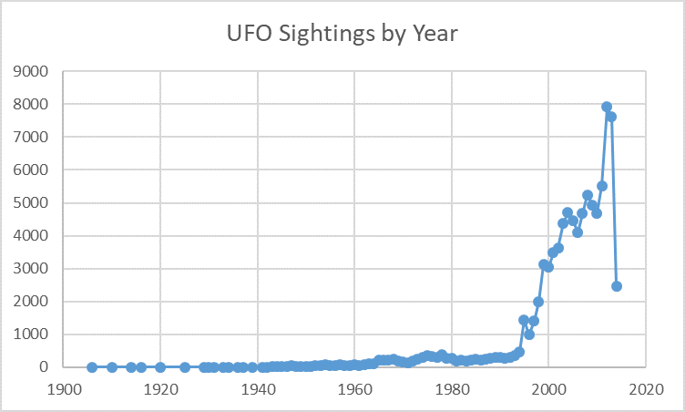
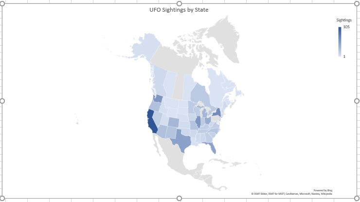

## README

## Project Name
	UFO Sightings from the Last Century
	44-564-01
	Project Group 1F
	Developers: Matthew Woolery, Pavithra Devdas
## Links
Repository: [https://bitbucket.org/mwoolery/ufo-sightings-from-the-last-century](https://bitbucket.org/mwoolery/ufo-sightings-from-the-last-century)

Issue Tracker: [https://bitbucket.org/mwoolery/ufo-sightings-from-the-last-century/issues?status=new&status=open](https://bitbucket.org/mwoolery/ufo-sightings-from-the-last-century/issues?status=new&status=open)

## Introduction
	Our project is an analysis of reported UFO sightings from the past century.  We would like to see count of the number of annually reported
	UFO Sightings so we can see if there has been an increase in sightings over the years or how sighting counts have changed after some famous 
	UFO events such as Roswell in the late 1930's.  We would also like to check the amount of sightings for each state, that way we can tell if 
	a certain state is more likely to report sightings, and because of this we could infer that we are more likely to sight one ourselves in one of
	these states.
## Data Source
	We found a source of data that is about 28MB in size which includes information about 89000 reported UFO Sightings. The fields included in this
	data source are datetime, city, state, country, shape, duration (seconds), duration(hours/min), comment, date posted, latitude, longitude.  It
	came in a CSV file and appears to be well structured data.
	Examples of values given are:
		datetime: 10/10/1949 20:30
		city: san marcos
		state: tx
		country: us
		shape: cylinder
		duration(seconds): 2700
		duration(hour/min): 45 minutes
		comment: This event took place in early fall around 1949-50...
		dateposted: 4/27/2004
		latitude: 29.8830556
		longitude: -97.9411111
	The dates and times go back to the early 1900's. The city, state, and country are given for a few different countries, we will primarily look at North American cities.
	

## Data Source Link
[https://www.kaggle.com/NUFORC/ufo-sightings/data](https://www.kaggle.com/NUFORC/ufo-sightings/data)
## The Challenge (Big Data Qualifications)
	Volume: It is has around 89000 records, although this can be done with excel for the most part, it is still many records that we could not do buy hand easily but it will continue to grow
	Variety: A variety of calculations can be done, you could find occurences by location, figure out common shapes and descriptions, and find how the have changed in the past century
	Veracity: The data is mostly easy to go through, but if you wanted to analyze the comments given by each person, it could be challenging.
	Velocity: It is easy to tell that the amount of sightings have gone up rapidly, the beginning of the century only has a few reports, but later on there are thousands per year.
## Big Data Questions
	Matt's Question: Has the amount of sightings per year changed after famous UFO events such as Roswell has occured. I will be finding the count of sightings
					 by year and looking at famous UFO events to see if after their occurance caused some increase or decrease. An increase could signify that
					 it may just be people trying to report UFO's to be part of a bandwagon. No dramatic change could mean that sightings are just becoming more common
	
	Pavithra's Question: I will find the count of the number of reported UFO sightings for each state in North America.
	
## Big Data Solutions
	Matt Big Data Solutions:
		Mapper input (CSV Formatted File):  10/13/1996 3:19	reno	nv	us	triangle	2400	40 min.	At 3:19 am&#44 bright light seen outside window and then one small tugboat triangular shaped aircraft seen over the house and then both oc	3/7/1998	39.5297222	-119.8127778
		Mapper output / Reducer input:  1940	1
		Reducer output:  1940	 159
		Language:  I will be using Python
		Chart: I will display a scatter chart, that way you can view how the values had increased or decreased by year. 
	Pavithra Big Data Solutions:
		Mapper input (CSV Formatted File): 10/10/1949 20:30	san marcos	tx	us	cylinder	2700	45 minutes	This event took place in early fall around 1949-50. It occurred after a Boy Scout meeting in the Baptist Church. The Baptist Church sit	4/27/2004	29.8830556	-97.9411111	
		Mapper output / Reducer input: tx 1
		Reducer output:tx 4394
		Language: I will be using Python
		Chart: I will display a heat map, which shows what state has how many UFO sightings
		
## Setup Instructions
	Have python 2.6.6, git bash window, and python set up in your system environment variables path.
	
	Matt: Run mapper.py with: python mapper.py
		  Run sorter.py with: python sorter.py
		  Run reducer.py with: python reducer.py
		  
		  MapReduce has been completed and the output is stored in mattresults.txt which you should then open in excel
		  In excel, import the data and separate the data by commas since it is in a csv format
		  Clean data as needed and select the data to create a scatter plot chart
		  
	Pavithra: Run mapper.py with: python mapper.py
		  	  Run sorted.py with: python sorted.py
		  	  Run reducer.py with: python reducer.py
			  
			  The MapReduce jobs are done. For each stae Ufo Sigthings are listed and the output is stored in resutls.txt file.
			  Open the results in excel and import the data and the data is separated by comma and select all the rows to create the 
			  heat map for the relevant data.
## Images

		  
## What the Data Means
	We tried to answer our quetions using MapReduce on our data source and were successful in finding some valuable information that could help people
	that are trying to find UFO's, know where to go and have an explanationn for why sightings may increase at different points in time.
	
	Looking at the Count By Year problem shown in the first image, we see that that UFO sightings were relatively low throughout the early part of the
	past century with a few spikes occuring in the 70s.  One could speculate that the increase in encounters at this time could be due to the release
	of many extraterrestrial themed movies such as Star Wars, and Close Encounters of the Third Kind.  The next biggest increase in UFO sightings occurs
	in the early 90's and continues up to now, we suspect that the increase in the amount of communication that occurs between people through the internet
	and mobile phones has gotten people to talk and report about things that they see.
	
	Looking at the Count by State problem in the second image, we see that UFO sightings occur throughout North America, but we found that the distribution
	of these sightings across states shows that there are some areas that have more UFO sightings.  When thinking of UFOs, you may think of the Southwest
	United States, namely Arizona and New Mexico, the data shows that the Southwestern states have generally higher sighting counts than other states.
	Other states with high number of sightings are states that are more densely populated and have more major cities in them such as California and New York.
	States that have lots of farmland such as Illinois also have lots of sigtings, maybe because when we think of aliens, we think of farms as well.
	The top 5 UFO sighting states are California, New York, Illinois, Washington, and Texas.
